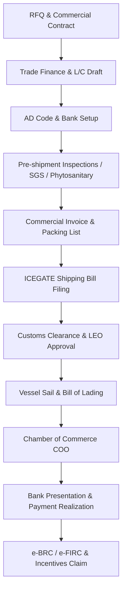

# Standard Operating Procedure (SOP): A-to-Z Export Documentation Workflow

This Standard Operating Procedure (SOP) details the end-to-end (A-to-Z) documentation requirements, workflow sequence, compliance checkpoints, and realization procedures for commodities exported from India under the **Foreign Trade Policy (FTP)** and **Customs Act, 1962**.

---

## Document Workflow Timeline at a Glance

---

## Phase 1: Commercial Contract & Pre-Shipment Configuration

### 1. Inquiry & Purchase Order (PO) Check
* **Objective:** Ensure the buyer's specifications align with Indian regulatory constraints and operational capabilities.
* **Key Tasks:**
  1. Verify the buyer’s registered company profile, country sanctions list, and trade history.
  2. Confirm product parameters (purity, moisture, packaging, and size specs).
  3. Formally accept the buyer's **Purchase Order (PO)** or execute a bilateral **Sales Contract**.

### 2. Proforma Invoice (PI) Generation
* **Objective:** Finalize terms of purchase, pricing, and bank details before production or dispatch.
* **Key Fields Required:**
  * Complete seller details (IEC - Importer Exporter Code, GSTIN, registered office).
  * Complete buyer details (including target discharge port and billing address).
  * Port of Loading (e.g., Mundra, Nhava Sheva) and Port of Discharge.
  * Incoterms (e.g., FOB, CFR, CIF) and detailed item descriptions with 8-digit **HS Codes**.
  * Payment terms (e.g., 30% advance T/T, 70% against B/L scans, or Irrevocable Letter of Credit).
  * Standard disclaimer on quality inspection rights (e.g., *"SGS/Intertek check prior to container sealing is final"*).

---

## Phase 2: Trade Finance & AD Code Setup

### 3. Bank AD Code Registration
* **Objective:** Map the exporter's bank account with Indian Customs (ICEGATE) at the specific port of loading.
* **Process:**
  1. Obtain an **Authorized Dealer (AD) Code letter** from the partner bank.
  2. Register the AD Code online through the **ICEGATE Portal** for the specific customs port of loading (e.g., INMUN1 for Mundra, INNSA1 for Nhava Sheva).
  3. Ensure active linking to receive duty drawbacks, RoDTEP claims, and to facilitate shipping bill validation.

### 4. Letter of Credit (L/C) Verification
* **Objective:** Audit the Letter of Credit to eliminate the risk of banking discrepancies that cause payment delays.
* **Checklist Items:**
  * **Consignee Field:** Verify exact spelling (avoid dashes/commas mismatch, e.g., "Al-Noor Food Trading LLC" vs "Al Noor Food Trading LLC").
  * **Shipment Deadline:** Ensure the deadline is at least 15 days *after* planned cargo stuffing to handle port/vessel delays.
  * **Documents Required:** Cross-check the requested list (e.g., Invoice copies, Original Bill of Lading, Certificate of Origin, Phytosanitary Certificate).
  * **Incentive/Discrepancy Clauses:** Eliminate ambiguous clauses such as *"Payment subject to buyer approval of sample on arrival"*.

---

## Phase 3: Pre-Shipment Inspections & Certifications

### 5. Quality & Technical Inspections
* **Objective:** Validate cargo parameters prior to port entry to avoid rejection at the destination.
* **Types of Inspections:**
  1. **SGS / Intertek Quality Audit:** Independent surveyor visits the warehouse/stuffing location to take samples, verify moisture, grade, packaging, and seal the container.
  2. **Certificate of Analysis (COA):** Laboratory test report indicating technical details (e.g., curcumin content for turmeric, moisture for rice).

### 6. Regulatory Certifications
* **Objective:** Comply with bio-security and phytosanitary rules in both origin and destination countries.
* **Core Certificates:**
  * **Phytosanitary Certificate:** Required for raw plant products (rice, grains, spices, onions). Issued by the **Plant Quarantine Department** after inspection and container fumigation.
  * **FSSAI Export Certificate:** Food safety assurance issued by the Food Safety and Standards Authority of India (if required).
  * **USDA/FDA Registrations:** Prior notices or registration numbers if exporting to the United States.

---

## Phase 4: Customs Clearance & Port Gates (ICEGATE)

### 7. Commercial Invoice & Packing List
* **Objective:** Establish the legally binding manifest of the goods shipped.
* **Compliance Checks:**
  * Commercial Invoice value must match the L/C terms and bank declarations.
  * The **Packing List (PL)** must outline the itemized details: container number, seal number, net weight, gross weight, package dimensions, and number of bags/pallets.

### 8. Shipping Bill (S/B) Filing
* **Objective:** Formally apply to Indian Customs to export the goods.
* **Process:**
  1. Submitted electronically on **ICEGATE** by the Customs Broker (CHA).
  2. Declare the appropriate export incentive schemes under **RoDTEP (Remission of Duties and Taxes on Exported Products)** or **Duty Drawback**.
  3. Declare the LUT (Letter of Undertaking) details to process the export under GST zero-rated provisions.

### 9. Let Export Order (LEO) Approval
* **Objective:** Obtain the customs department's final clearance allowing the cargo to be loaded on the vessel.
* **Process:**
  1. The container arrives at the port terminal/CFS (Container Freight Station).
  2. The customs officer conducts physical seal inspections and verifies documentation.
  3. Once validated, the customs officer grants **LEO (Let Export Order)** on the ICEGATE system.
  4. **CRITICAL:** Cargo cannot be loaded onto the vessel without a valid LEO.

---

## Phase 5: Cargo Transit & Carriage Documents

### 10. Bill of Lading (B/L) / Air Waybill (AWB)
* **Objective:** Transfer the custody of goods to the shipping line and obtain the title document of the cargo.
* **Checkpoints:**
  * Ensure the B/L states *"Shipped on Board"* rather than *"Received for Shipment"*.
  * Consignee, Notify Party, and Marks must match the L/C instructions exactly.
  * Retain 3 originals and 3 copies. Release to the buyer only after payment realization or bank presentation.

### 11. Marine Insurance Certificate
* **Objective:** Protect cargo value against damage or loss during sea carriage.
* **Incoterm Mapping:**
  * Required under CIF terms (Exporter pays for insurance). Under FOB/CFR, the importer arranges insurance, but a declaration notice must be sent to the importer immediately upon shipping.

---

## Phase 6: Post-Shipment & Benefits Realization

### 12. Certificate of Origin (COO)
* **Objective:** Enable the buyer to avail preferential import customs duty rates at the port of destination.
* **Process:**
  1. File the invoice and shipping details on the **DGFT Common Digital Platform** (or through local Chamber of Commerce).
  2. Receive COO under specific trade agreements (e.g., India-UAE CEPA, AIFTA, or non-preferential general COO).

### 13. Bank Presentation & Realization
* **Objective:** Collect payments from the buyer's bank through trade channels.
* **Tasks:**
  1. Submit the complete set of original documents (Invoice, Packing List, Original B/L, COO, Phytosanitary, SGS report) to your AD Bank.
  2. Bank forwards the package to the buyer’s bank.
  3. Realize funds and verify currency conversion matches the booked forex hedges.

### 14. e-BRC / e-FIRC & Incentives Claim
* **Objective:** Close the trade loop with the Reserve Bank of India (RBI) and receive government incentive rebates.
* **Process:**
  1. Upon payment realization, the partner bank uploads the details to the **IRPMS (Integrated Foreign Exchange Rate Management System)**.
  2. Download the **e-BRC (Electronic Bank Realization Certificate)** or **e-FIRC (Foreign Inward Remittance Certificate)** from the bank portal.
  3. Submit the realized shipping bill and e-BRC references on the DGFT/Customs portals to credit the RoDTEP/Duty Drawback accounts.
